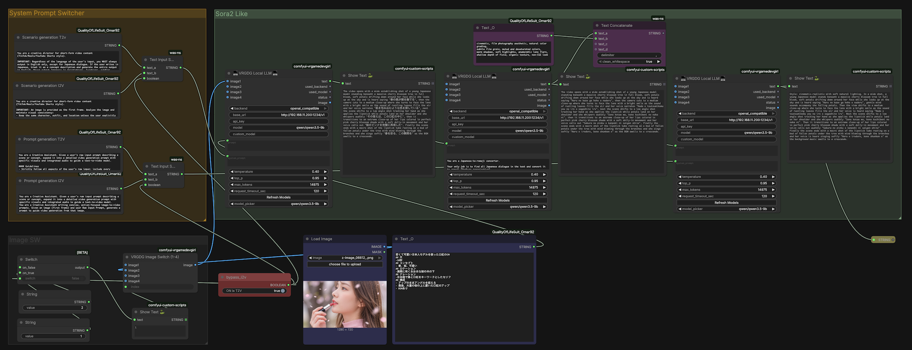

# LTX-2.3 Sora2風ワークフロー

LLMを使ったシナリオ生成とLTX-2.3による映像生成を組み合わせた、Sora2風の動画生成パイプラインです。

## 概要

キーワードや概念を入力するだけで、3段階のLLMパイプラインが動画生成用プロンプトを自動生成します。

1. **シナリオ生成** — 日本語台詞入りのマルチシーン構成を生成
2. **日本語/ローマ字変換** — LTX-2.3の音声生成用に台詞をローマ字へ変換
3. **LTX-2.3用プロンプト変換** — シナリオを動画生成に適した詳細プロンプトへ拡張

## ファイル構成

| ファイル | 説明 |
|------|-------------|
| `scenario_t2v.md` | T2V用シナリオ生成 System Prompt |
| `scenario_i2v.md` | I2V用シナリオ生成 System Prompt |
| `ltx2_prompt_t2v.md` | LTX-2.3 T2V用プロンプト変換 System Prompt |
| `ltx2_prompt_i2v.md` | LTX-2.3 I2V用プロンプト変換 System Prompt |
| `japanese_to_romaji.md` | 日本語/ローマ字変換 System Prompt |
| `make_scenario_by_LLM.json` | ComfyUI ワークフロー |
| `make_scenario_by_gemma3.json` | ComfyUI LTX-2.3 gemma-3-12b-it使用 ワークフロー |

## 必要環境

- ComfyUI
- LTX-2.3
- LM StudioまたはOpenAI API互換のLLMサーバー
- I2V使用時はVision対応LLM（Qwen3.5-9B以上推奨）

## Workflow

## 使い方

1. `make_scenario_by_LLM.json` をComfyUIで読み込む
2. 最終テキスト出力をLTX-2.3ワークフローのCLIP Text Encode（Positive Prompt）ノードに接続
3. I2V使用時はリファレンス画像をセットし、Vision対応LLMを使用
4. T2Vのみの場合はgpt-oss-20b/120bなど大規模モデルも利用可能
5. make_scenario_by_gemma3.jsonは、LTX-2.3が使用するgemma-3-12b-itをそのままLLMとして流用。省リソース

## 備考

- 台詞は日本語で生成し、ローマ字変換でLTX-2.3の発音問題に対応
- シネマティックスタイル付加（フィルムグレイン、アナモフィックフレアなど）はオプション、不要な場合は該当ノードを外すだけ
- System PromptはLM Studio単体＋外部動画生成サービス（Grok Imagine、Sora2など）との組み合わせでも利用可能

## 作者

[@PhotogenicWeekE](https://x.com/PhotogenicWeekE)
